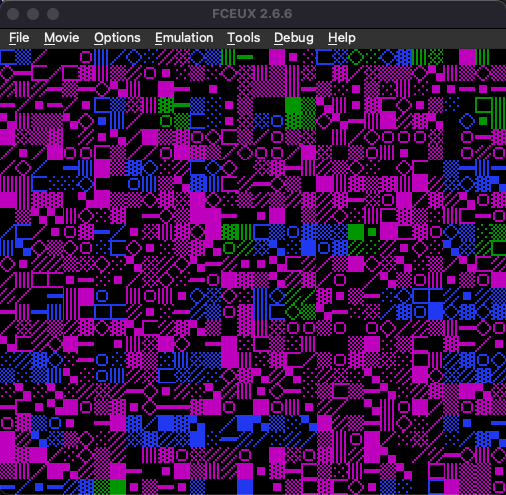
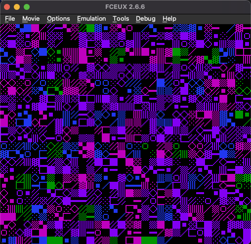
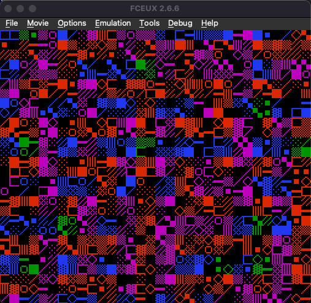

# NES Chaos / Techno

A psychedelic audio-visual program for the Nintendo Entertainment System (NES). Pure 6502 assembly generating evolving techno music and morphing visual patterns.

## Screenshots

<p align="center">
  
  
  
</p>

## Video Demo

[▶️ Watch techno_nes.mp4](techno_nes.mp4)

## Features

- **Procedural Techno Music**: Kick, snare, hi-hat, bass, lead synth, and arpeggio - all generated in real-time
- **7 Song Sections**: Intro, acid, breakdown, drop, peak, buildup, minimal - cycling every ~4 bars
- **Beat-Reactive Visuals**: Pattern morphs and colors pulse in sync with the music
- **~18 Minute Cycle**: Full mathematical repeat takes ~18 minutes at 60fps

## Building

Requires ca65/ld65 from the cc65 suite:

```bash
make techno    # Build techno.nes
make           # Build chaos.nes
```

## Running

```bash
fceux techno.nes
```

## Files

- `techno.s` - Main audio-visual program (stable, full-featured)
- `chaos.s` - Simplified variant
- `nrom.cfg` - Linker configuration for NROM mapper

## Technical Details

- **Mapper**: NROM (Mapper 0)
- **PRG ROM**: 16KB
- **CHR ROM**: 8KB
- **Audio**: All 4 APU channels (2x Pulse, Triangle, Noise)
- **Visuals**: Single parameterized renderer updating 16 tiles/frame

